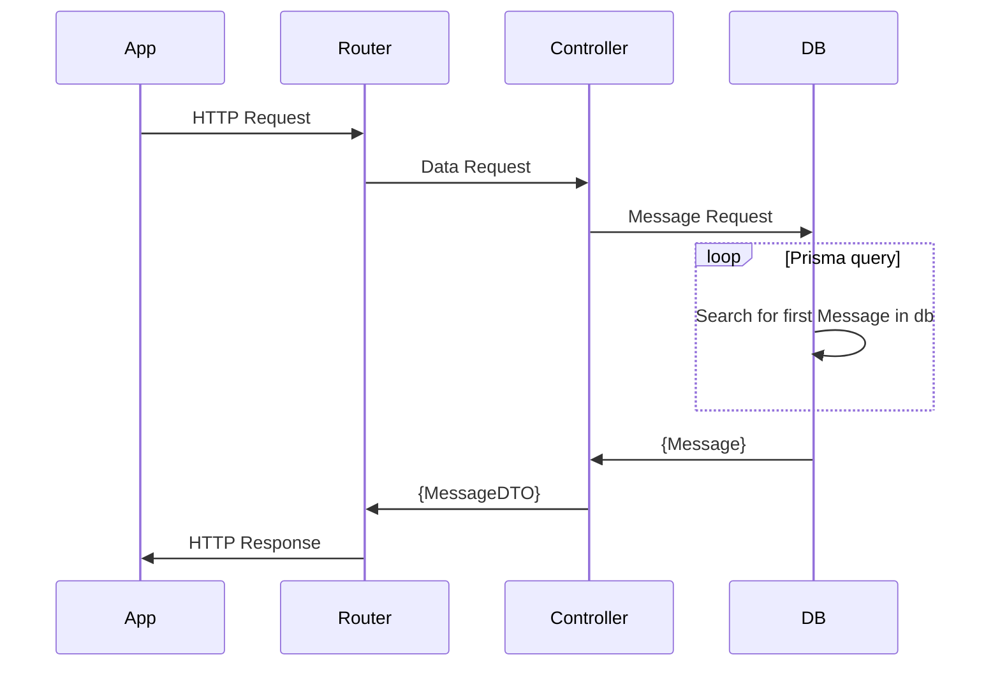

# Express API Boilerplate
Boilerplate Express API With Typescript and Prisma support 

## Using this boilerplate
To install: 

```
# clone this repo
git clone https://github.com/llorrac1/express-boilerplate

# install dependencies 
npm install

# compile typescript
npx tsc
```

Add an env file 
```
touch .env
```

Add a PORT variable and DB location to .env
```
DATABASE_URL="file:./dev.db"
PORT='3000'
```

To confirm or commit changes to DB models run 
```
npx prisma migrate dev --name init
```

When you're ready to run the app
```
npm start
```

## Dependencies 
Express: https://expressjs.com/ 

Prisma: https://www.prisma.io/docs 

Dotenv: https://github.com/motdotla/dotenv

## Extra
### Architecture 



### Workflow to rebuild 
Short hand notes to start from scratch with these packages if you wanted to... no guarantees on accuracy of these commands. 

`npm init -y`

`npm install typescript ts-node @types/node --save-dev`

`npx tsc --init`

`npm install express @types/express --save-dev`

... Flesh out project structure 

`npm install prisma --save-dev` 

`npx prisma init --datasource-provider sqlite`

... Add any models to the schema 

`npx prisma migrate dev --name init`

`npx tsc`
