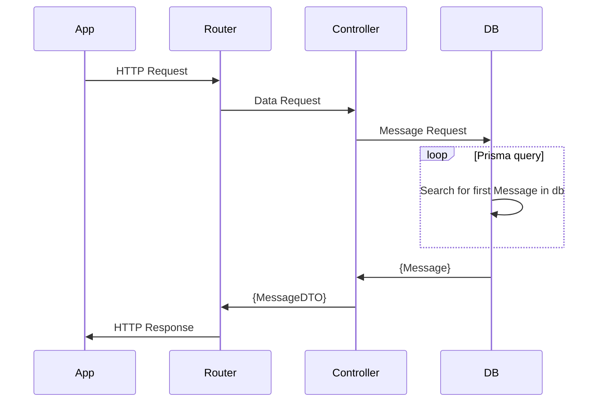

# Express API Boilerplate
Boilerplate Express API With Typescript and Prisma support 

## Using this boilerplate
To install: 

```
git clone {this repo}
npm install
npm start
```

On changes to DB models run 
```
npx prisma migrate dev --name init
```


## Dependencies 
Expresss: https://expressjs.com/ 

Prisma: https://www.prisma.io/docs 

Dotenv: https://github.com/motdotla/dotenv

## Extra
### Architecture 




### Workflow to rebuild 
Short hand notes to start from scratch with these packages if you wanted to... no guarantees on accuracy of these commands. 

`npm init -y`

`npm install typescript ts-node @types/node --save-dev`

`npx tsc --init`

`npm install express @types/express --save-dev`

... Flesh out project structure 

`npm install prisma --save-dev` 

`npx prisma init --datasource-provider sqlite`

Add any models to the schema 

`npx prisma migrate dev --name init`

`npx tsc`

Prisma: https://www.prisma.io/docs/getting-started/quickstart 
